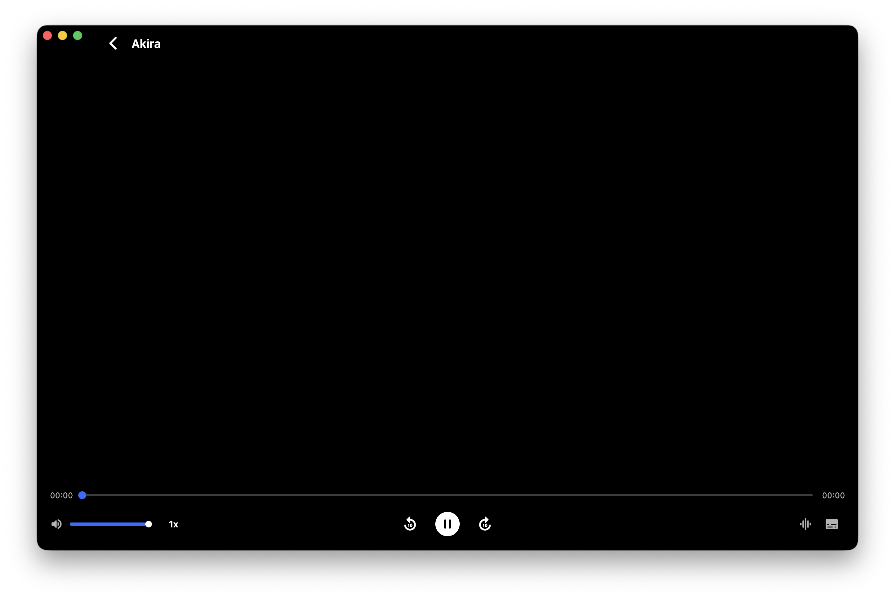

# Open Filmly

Open Filmly is a desktop media library player for macOS and Windows. It is now
a Flutter application backed by native VLC playback, replacing the old Electron
code.

The app is built for private media libraries: local folders, SMB shares,
WebDAV servers, Emby, and Jellyfin-style sources. It scans media, cleans file
names, enriches titles through TMDB, tracks playback progress, and plays video
inside the app with VLC's codec, audio-track, and embedded-subtitle support.

## Screenshots




## What works

- macOS and Windows desktop clients built with Flutter.
- Native embedded VLC player through `VLCKit` on macOS and `libVLC` on Windows.
- Local file, HTTP, WebDAV, and SMB playback.
- SMB streaming through a local HTTP Range proxy.
- Emby library import and browsing.
- TMDB metadata matching, poster walls, favorites, recent playback, and
  continue-watching shelves.
- Embedded audio and subtitle track discovery with Chinese subtitle preference.
- Native window controls, safe-area spacing, keyboard shortcuts, and
  double-click fullscreen on the video surface.

## Repository layout

- `app/` contains the Flutter application.
- `app/macos/` contains the macOS host app and the VLCKit bridge.
- `app/windows/` contains the Windows host app and the libVLC bridge.
- `app/packages/smb_connect/` is the local SMB client package used by the app.
- `docs/screenshots/` contains README screenshots.

The legacy Electron, Vite, React, Node, and Go desktop code has been removed
from the main branch.

## Requirements

- macOS 13 or newer recommended for macOS builds.
- Windows 10 or newer recommended for Windows builds.
- Flutter 3.44 or newer.
- Xcode command line tools.
- CocoaPods, used to install `VLCKit`.
- VLC for Windows, or a bundled VLC runtime next to `open_filmly.exe`.

Install CocoaPods if needed:

```bash
sudo gem install cocoapods
```

## Run locally

```bash
cd app
flutter pub get
cd macos && pod install && cd ..
flutter run -d macos
```

## Build

macOS:

```bash
cd app
flutter pub get
cd macos && pod install && cd ..
flutter build macos --release
scripts/make_dmg.sh build/Open-Filmly.dmg
```

The release app is written to:

```text
app/build/macos/Build/Products/Release/open_filmly.app
```

Windows:

```powershell
cd app
flutter pub get
flutter build windows --release
```

The Windows VLC bridge dynamically searches for `libvlc.dll` in this order:

```text
<open_filmly.exe directory>\vlc\libvlc.dll
<open_filmly.exe directory>\libvlc.dll
C:\Program Files\VideoLAN\VLC\libvlc.dll
C:\Program Files (x86)\VideoLAN\VLC\libvlc.dll
PATH
```

For a self-contained Windows package, copy VLC's `libvlc.dll`, `libvlccore.dll`,
and `plugins\` directory into:

```text
app\build\windows\x64\runner\Release\vlc\
```

## Verification

```bash
cd app
flutter analyze --no-fatal-infos --no-fatal-warnings
flutter test
flutter build macos --debug
```

Windows builds must be verified on Windows:

```powershell
cd app
flutter build windows --debug
```

## Real SMB test

The normal test suite does not require a real NAS. To run the optional real SMB
test, set these variables first:

```bash
export OPEN_FILMLY_REAL_SMB_HOST=192.168.1.10
export OPEN_FILMLY_REAL_SMB_USERNAME=username
export OPEN_FILMLY_REAL_SMB_PASSWORD=password
export OPEN_FILMLY_REAL_SMB_SHARE=Movies
export OPEN_FILMLY_REAL_SMB_DOMAIN=

cd app
flutter test test/integration_smb_real_test.dart
```

## VLC note

VLCKit and libVLC are licensed under LGPL terms. Keep the VLC framework/runtime
dynamically linked and preserve the license obligations when packaging the app.
